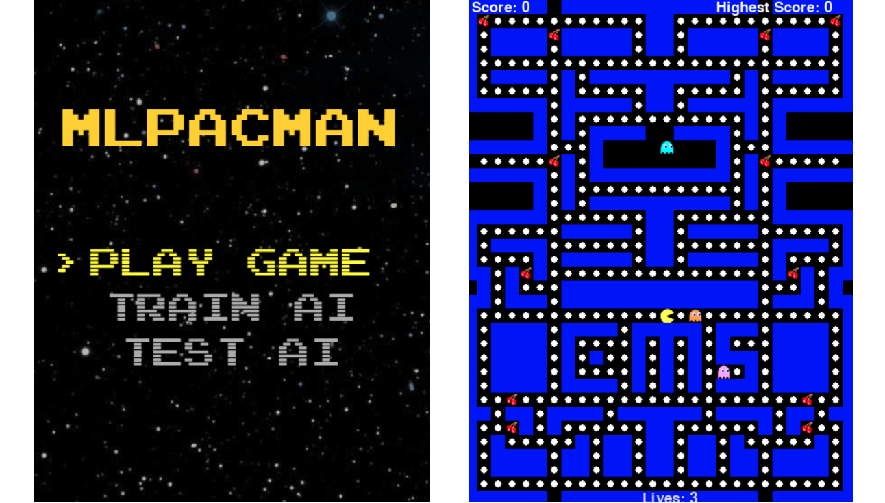
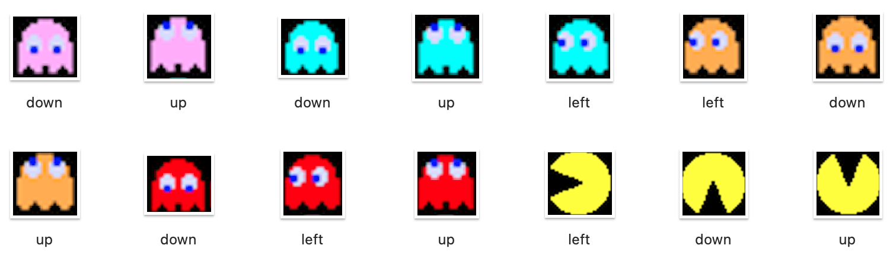

# MLPacMan: Reinforcement Learning in Pac-Man

 

## Project Overview
MLPacMan is remake of the classic arcade game Pac-Man, enhanced with artificial intelligence to explore game dynamics 
and decision-making through Deep Q-Networks (DQN) and Dueling Deep Q-Networks (Dueling DQN). This project aims to 
demonstrate the application of reinforcement learning techniques and provide insights into human-computer interaction 
within a controlled game environment.

## Table of Contents
- [Introduction](#introduction)
- [Game Description](#game-description)
- [Programming Language and Software](#programming-language-and-software)
- [Artificial Intelligence](#artificial-intelligence)
- [Conclusions and Future Work](#conclusions-and-future-work)
- [Installation](#installation)
- [Credits](#credits)

## Introduction
This project integrates AI into the game of Pac-Man to evaluate AI decision-making and strategic planning in dynamic and
constrained environments. Another goal was to get and insight of game development and enhance the user experience through
effective human-computer interaction.

### Methodology
The AI models, DQN and Dueling DQN, can be trained using an epsilon-greedy strategy, ensuring a balance between 
exploration of new strategies and exploitation of known strategies to optimize gameplay.

## Game Description
MLPacMan offers both manual play and AI-driven modes, where players can engage directly or watch an AI navigate the maze. 
The game introduces complexities like power pellets and ghost strategies, providing a rich interaction layer.

### Core Functionalities
- **Initialization and Setup:** The game initializes with a menu allowing players to select between playing modes.
- **Game Mechanics:** The game simulates Pac-Man's maze exploration, dot collection, and ghost avoidance.
- **AI Interaction:** In AI mode, Pac-Man is controlled by either a DQN or Dueling DQN model that learns from the game environment to optimize decision-making.

### Sprites and Assets
The game utilizes detailed sprites for Pac-Man and ghosts, dynamically adjusting based on game events. These include different sprites for ghost modes and Pac-Man's directions.



## Programming Language and Software
Python was selected due to the developer’s familiarity, which streamlined development and debugging. Key libraries include:
- **Pygame:** For rendering and game state management.
- **PyTorch:** For implementing and training neural network models.
- **Matplotlib:** For visualizing training results.

### Architecture
The game architecture is modular, separating game mechanics, AI components, and rendering to facilitate maintenance and scalability. The AI models interact directly with the game environment, processing states and calculating rewards based on game dynamics.

## Artificial Intelligence
DQN and Dueling DQN models were integrated with an epsilon-greedy strategy. This setup helps the AI navigate the game's 
maze efficiently and learn optimal strategies through continuous interaction with the game environment.

### Training and Fitness Function
The `optimize_model` method of the `PacmanAgent` class encapsulates the AI training process, employing experiences and 
rewards to adjust and improve the AI strategies dynamically.

## Conclusions and Future Work
The project highlighted significant insights into AI capabilities and limitations within video game environments. Future work will focus on refining AI strategies, enhancing reward mechanisms, and exploring more complex AI models to better emulate human gameplay nuances.

## Installation
To set up the MLPacMan game on your local machine for development and testing purposes, follow these steps:

```bash
git clone https://github.com/BugGreen/MLPacMan.git
cd MLPacMan
pip install -r requirements.txt
python pacman.py
```
If you find this project useful for your research or development, consider giving it a star on GitHub to encourage 
future updates and enhancements!

### Credits
Developed by Nicolás Rojas Bernal at Technische Universität Dresden, Interactive Media Lab.
